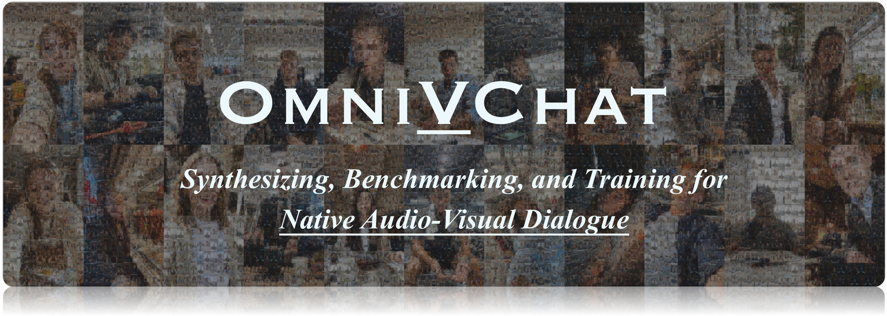
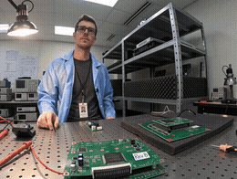
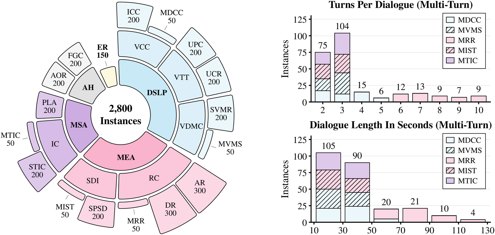
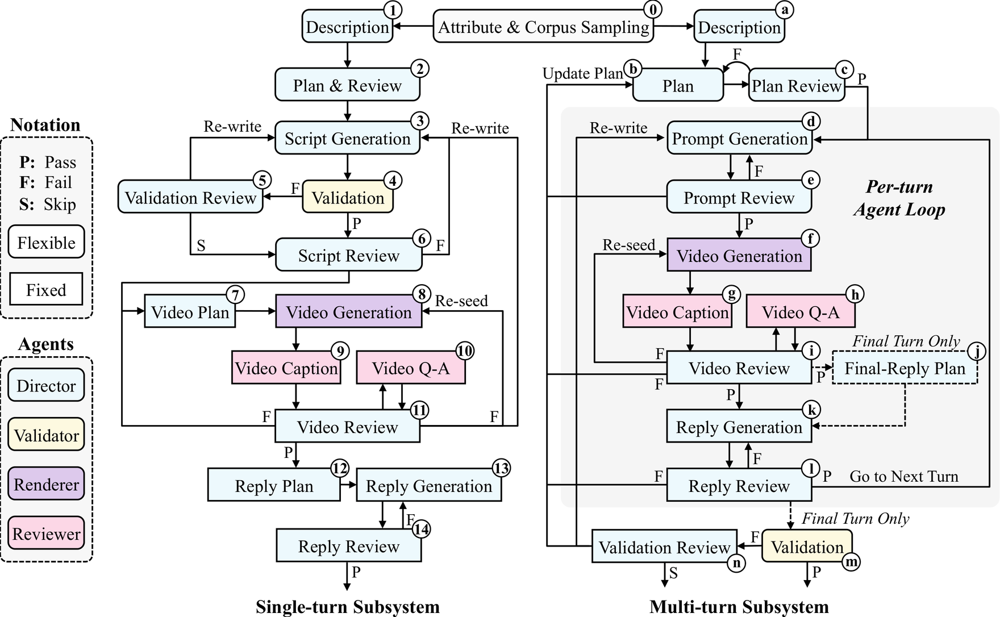
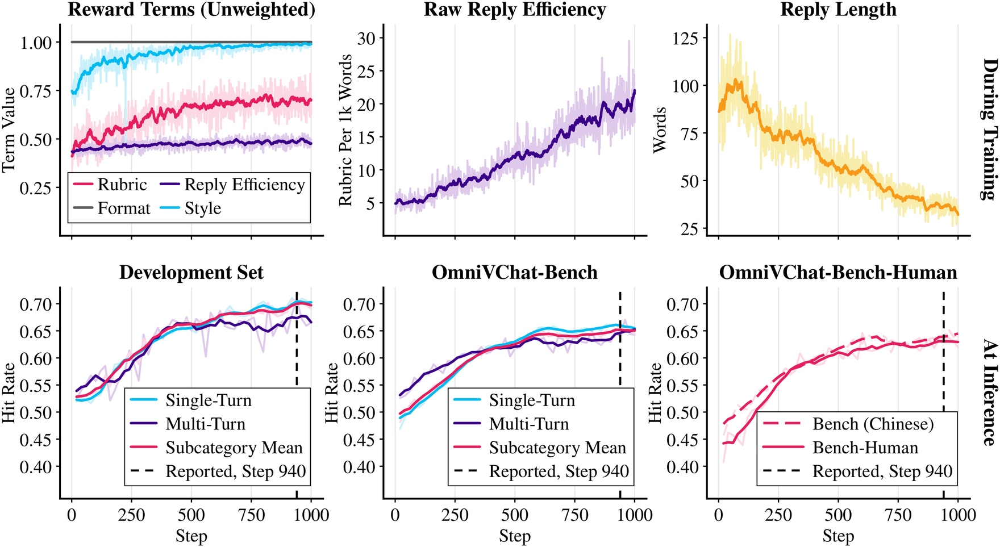

# OmniVChat: Synthesizing, Benchmarking, and Training for Native Audio-Visual Dialogue

<div align="center"><a href="https://huggingface.co/datasets/Harland/OmniVChat"></a>&nbsp;&nbsp;</div>
<div align="center"></div>
<div align="center"><sup>1</sup> The Chinese University of Hong Kong&emsp;<sup>2</sup> Alibaba Token Hub, Alibaba Group</div>
<div align="center"><sup>3</sup> Shanghai Jiao Tong University&emsp;<sup>4</sup> Shanghai Innovation Institute&emsp;<sup>5</sup> Zhejiang University</div>
<br>

**OmniVChat** (Omni Video Chat) is the task of native audio-visual dialogue: an omni model
directly and simultaneously receives audio and video from a user and returns text. The user's
query is inside the audio and video. There is no separate text question, no external
captioning, no ASR transcript.

This is the code-only OmniVChat repository. It contains the evaluation and reward code,
examples, and documentation, while the full dataset annotations and media are distributed
separately through the complete repository linked below.

The release contains two components from the paper. They grade a reply against the same rubric,
but they answer different questions and their scores live on different scales, so a number
from one is not comparable with a number from the other:

| | | |
|---|---|---|
| [**OmniVChat-Bench**](#2-omnivchat-bench) | evaluation | 2,800 dialogues with tiered rubrics, scored to `r(y) ∈ [0, 1]`, reported as Subcategory Mean. Scorer in `eval/`, samples in `examples/`, full data on [Hugging Face](#21-getting-the-data) |
| [**OmniVChat-RL**](#3-omnivchat-rl) | training | the reward recipe: `r(y)` plus format, efficiency and style terms, range `[0, 1.5]`. `reward/` |

Both grade the same rubric with the same judge and the same tier gate — `eval/score.py`
imports that core from `reward/reward.py`, so the rubric term has exactly one definition.
What differs is what is added on top and how a judge failure is handled. See
[Why the two scores are not comparable](#31-why-the-two-scores-are-not-comparable).

> **Two rubrics for MSA-PLA.** The 200 `MSA-PLA` instances ship with **two independent
> rubrics** for the same dialogue, because the right answer depends on an assumption you have
> to make explicit. `key_points` assumes the model has **no body**: asked to push a window
> open, it should say it cannot act and offer an alternative. `key_points_embodied` assumes an
> **embodied** model that can act: it should accept the task, identify the right object, and
> answer briefly. Every other subcategory has one rubric. Pick one for MSA-PLA and say which —
> a score is not comparable across the two. Details in
> [MSA-PLA: two rubrics](#25-msa-pla-two-rubrics).

## 1. What a dialogue looks like

Eight dialogues, covering all five abilities. Each clip is the user's side: the model receives
exactly this audio and video, and returns text.

**The previews below are downsampled, and are not what a model sees.** They are cut down hard so
this page loads at all: 260 px wide, 10 fps, 64 colours, silent, and only the first 3.2 seconds.
**Click one to play it with sound** — the query is in the audio, so a silent preview tells you
half of it at best. Even that link is a 480p re-encode. The benchmark media itself is **1080p with audio**, in
the dataset ([Harland/OmniVChat](https://huggingface.co/datasets/Harland/OmniVChat)) — this
repository carries the code and the examples, not the media.

<table>
<tr>
<td align="center" valign="top" width="25%"><a href="https://huggingface.co/datasets/Harland/OmniVChat/blob/main/examples/clips/AH-AOR.mp4"></a></td>
<td align="center" valign="top" width="25%"><a href="https://huggingface.co/datasets/Harland/OmniVChat/blob/main/examples/clips/MEA-RC-AR.mp4"></a></td>
<td align="center" valign="top" width="25%"><a href="https://huggingface.co/datasets/Harland/OmniVChat/blob/main/examples/clips/DSLP-VTT-UPC.mp4"></a></td>
<td align="center" valign="top" width="25%"><a href="https://huggingface.co/datasets/Harland/OmniVChat/blob/main/examples/clips/MSA-PLA.mp4"></a></td>
</tr>
<tr>
<td align="center" valign="top"><strong>AH</strong><br><code>AH-AOR</code><br><sub>She asks what the model thought of the lullaby she just sang. She never sang.</sub></td>
<td align="center" valign="top"><strong>MEA</strong><br><code>MEA-RC-AR</code><br><sub>He asks what to bring “over there”; the video identifies the court's filing hall.</sub></td>
<td align="center" valign="top"><strong>DSLP</strong><br><code>DSLP-VTT-UPC</code><br><sub>He stops mid-sentence, still thinking. The model should wait, not answer.</sub></td>
<td align="center" valign="top"><strong>MSA</strong><br><code>MSA-PLA</code><br><sub>He asks the model to put a circuit board on the rack — it has no hands.</sub></td>
</tr>
<tr>
<td align="center" valign="top"><a href="https://huggingface.co/datasets/Harland/OmniVChat/blob/main/examples/clips/ER.mp4"></a></td>
<td align="center" valign="top"><a href="https://huggingface.co/datasets/Harland/OmniVChat/blob/main/examples/clips/DSLP-VDMC-SVMR.mp4"></a></td>
<td align="center" valign="top"><a href="https://huggingface.co/datasets/Harland/OmniVChat/blob/main/examples/clips/MEA-RC-MRR.mp4"></a></td>
<td align="center" valign="top"><a href="https://huggingface.co/datasets/Harland/OmniVChat/blob/main/examples/clips/MSA-IC-STIC.mp4"></a></td>
</tr>
<tr>
<td align="center" valign="top"><strong>ER</strong><br><code>ER</code><br><sub>Excited about an interview, she asks how to prepare. The reply should share her joy.</sub></td>
<td align="center" valign="top"><strong>DSLP</strong><br><code>DSLP-VDMC-SVMR</code><br><sub>The camera faces the road, not him. Left or right depends on noticing that.</sub></td>
<td align="center" valign="top"><strong>MEA</strong><br><code>MEA-RC-MRR</code><br><sub>Turn 7 of 7. She asks the colour of a vase shown earlier; only a past clip has it.</sub></td>
<td align="center" valign="top"><strong>MSA</strong><br><code>MSA-IC-STIC</code><br><sub>Late-night chat, she asks who it is. It should give its own name, not another product's.</sub></td>
</tr>
</table>

`MEA-RC-MRR` is multi-turn, so its preview is the final turn — the vase it asks about was shown
in an earlier one, which is the whole point of that subcategory. All 17 subcategories have a clip
in [`examples/clips/`](examples/clips), small enough to browse without downloading the 28 GB.

**What a rubric looks like.** For the [`DSLP-VDMC-SVMR`](examples/DSLP-VDMC-SVMR.json)
clip above, its `key_points` array is shown below. Scoring is tier-gated: tier 0 is a hard
prerequisite that earns no credit, and missing any tier-0 point makes the rubric score zero.
A hit at tier *n* ≥ 1 counts only after every point in all lower tiers has been hit; an incomplete
tier also keeps every higher tier locked. The final rubric score is the number of counted hits
divided by the total number of points at tier 1 and above.

| Tier | Point |
|---:|---|
| 0 | The response is in English, consistent with the language of the user's question |
| 1 | The response explicitly gives the directional answer as left (on your left / left side), correctly understanding that in rear-camera mode the left side of the frame corresponds to the user's left. |
| 2 | The response is concise and natural, matching the conversational style of a voice assistant in a driving scenario without lengthy explanations. |
| 3 | The response references the feature of the object indicated by the user (e.g., beige house), confirming that it is answering about the building the user asked about. |

## 2. OmniVChat-Bench

### 2.1 Getting the data

This repository holds the code and the documentation. The dialogues and their rubrics are on
Hugging Face, because the media is about 28 GB.

```bash
huggingface-cli download Harland/OmniVChat --repo-type dataset --local-dir data
```

That gives you the layout the rest of this README describes:

```
data/data/single_turn.jsonl
data/data/multi_turn.jsonl
data/media/single_turn/<id>.mp4
data/media/multi_turn/<id>/round_<n>.mp4
```

Media paths inside the JSONL are relative to the dataset root, so run the scorer from there,
or pass absolute paths. Every command below uses `$DATA` for that root:

```bash
export DATA=./data
```

### 2.2 Sample instances

[`examples/`](examples) holds one instance from each of the 17 subcategories: the data row
exactly as it appears in the dataset, plus a small re-encode of its clip so the repository is
browsable without the 28 GB download. For a multi-turn subcategory the clip is the **final**
turn, the one that gets scored.

| Subcategory | Ability | Turns | Data | Clip |
|---|---|---|---|---|
| `AH-AOR` | AH | single | [json](examples/AH-AOR.json) | [144 KB](https://huggingface.co/datasets/Harland/OmniVChat/blob/main/examples/clips/AH-AOR.mp4) |
| `AH-FGC` | AH | single | [json](examples/AH-FGC.json) | [223 KB](https://huggingface.co/datasets/Harland/OmniVChat/blob/main/examples/clips/AH-FGC.mp4) |
| `DSLP-VCC-ICC` | DSLP | single | [json](examples/DSLP-VCC-ICC.json) | [393 KB](https://huggingface.co/datasets/Harland/OmniVChat/blob/main/examples/clips/DSLP-VCC-ICC.mp4) |
| `DSLP-VCC-MDCC` | DSLP | multi | [json](examples/DSLP-VCC-MDCC.json) | [156 KB](https://huggingface.co/datasets/Harland/OmniVChat/blob/main/examples/clips/DSLP-VCC-MDCC.mp4) |
| `DSLP-VDMC-MVMS` | DSLP | multi | [json](examples/DSLP-VDMC-MVMS.json) | [223 KB](https://huggingface.co/datasets/Harland/OmniVChat/blob/main/examples/clips/DSLP-VDMC-MVMS.mp4) |
| `DSLP-VDMC-SVMR` | DSLP | single | [json](examples/DSLP-VDMC-SVMR.json) | [169 KB](https://huggingface.co/datasets/Harland/OmniVChat/blob/main/examples/clips/DSLP-VDMC-SVMR.mp4) |
| `DSLP-VTT-UCR` | DSLP | single | [json](examples/DSLP-VTT-UCR.json) | [269 KB](https://huggingface.co/datasets/Harland/OmniVChat/blob/main/examples/clips/DSLP-VTT-UCR.mp4) |
| `DSLP-VTT-UPC` | DSLP | single | [json](examples/DSLP-VTT-UPC.json) | [248 KB](https://huggingface.co/datasets/Harland/OmniVChat/blob/main/examples/clips/DSLP-VTT-UPC.mp4) |
| `ER` | ER | single | [json](examples/ER.json) | [313 KB](https://huggingface.co/datasets/Harland/OmniVChat/blob/main/examples/clips/ER.mp4) |
| `MEA-RC-AR` | MEA | single | [json](examples/MEA-RC-AR.json) | [323 KB](https://huggingface.co/datasets/Harland/OmniVChat/blob/main/examples/clips/MEA-RC-AR.mp4) |
| `MEA-RC-DR` | MEA | single | [json](examples/MEA-RC-DR.json) | [135 KB](https://huggingface.co/datasets/Harland/OmniVChat/blob/main/examples/clips/MEA-RC-DR.mp4) |
| `MEA-RC-MRR` | MEA | multi | [json](examples/MEA-RC-MRR.json) | [118 KB](https://huggingface.co/datasets/Harland/OmniVChat/blob/main/examples/clips/MEA-RC-MRR.mp4) |
| `MEA-SDI-MIST` | MEA | multi | [json](examples/MEA-SDI-MIST.json) | [420 KB](https://huggingface.co/datasets/Harland/OmniVChat/blob/main/examples/clips/MEA-SDI-MIST.mp4) |
| `MEA-SDI-SPSD` | MEA | single | [json](examples/MEA-SDI-SPSD.json) | [257 KB](https://huggingface.co/datasets/Harland/OmniVChat/blob/main/examples/clips/MEA-SDI-SPSD.mp4) |
| `MSA-IC-MTIC` | MSA | multi | [json](examples/MSA-IC-MTIC.json) | [259 KB](https://huggingface.co/datasets/Harland/OmniVChat/blob/main/examples/clips/MSA-IC-MTIC.mp4) |
| `MSA-IC-STIC` | MSA | single | [json](examples/MSA-IC-STIC.json) | [107 KB](https://huggingface.co/datasets/Harland/OmniVChat/blob/main/examples/clips/MSA-IC-STIC.mp4) |
| `MSA-PLA` | MSA | single | [json](examples/MSA-PLA.json) | [372 KB](https://huggingface.co/datasets/Harland/OmniVChat/blob/main/examples/clips/MSA-PLA.mp4) |

The two `_example_clip*` fields in those files are added here for convenience and are
not part of the dataset.

### 2.3 Contents

| | |
|---|---|
| 2,800 instances | 2,550 single-turn, 250 multi-turn |
| 5 ability categories | DSLP 900, MEA 900, MSA 450, AH 400, ER 150 |
| 17 subcategories | 22 scenario domains |
| 13,475 rubric criteria | tier 0: 2,800 · tier 1: 3,617 · tier 2: 5,051 · tier 3: 2,007 |
| Dialogue language | 1,766 English (63.1%), 1,034 Chinese (36.9%) |
| Media | 3,490 mp4, ~28 GB, 1080p. The user's speech is the video's own audio track |
| Two rubrics | MSA-PLA (200) carries a second, embodied-assistant rubric: 972 extra criteria |

<p align="center"></p>

*Left: the five ability categories and their 17 subcategories. Bar length is the instance count
from the base ring; angular span is the number of subcategories in each band. Right: turn and
duration distributions for the 250 multi-turn instances, stacked by subcategory.*

Ability categories:

- **DSLP** — Dialogue-State & Link Perception. Whether the model understands the current state
  of a dialogue: connection status, turn boundaries, camera orientation.
- **MEA** — Multimodal Entity Alignment. Whether it connects speech to the correct visible
  object or speaker.
- **MSA** — Model Self-Awareness. Whether it states its identity and physical limitations
  correctly.
- **AH** — Anti-Hallucination. Whether replies stay grounded in the available audio and visual
  evidence.
- **ER** — Emotion Recognition. Whether a reply uses facial and vocal emotion cues.

### 2.4 Layout

In this repository:

```
eval/score.py                 evaluation: rubric, format, style, length, efficiency
reward/reward.py              the reward itself, shared by both paths
reward/trainer_adapter.py     optional: wires it into a GSPO trainer
reward/prompts/               the judge prompts, used by BOTH paths
examples/                     one instance per subcategory, with a small clip
assets/                       figures used by this README
```

In the dataset, from Hugging Face:

```
data/single_turn.jsonl        2,550 rows
data/multi_turn.jsonl           250 rows
media/single_turn/<id>.mp4
media/multi_turn/<id>/round_<n>.mp4
```

Media paths in the JSONL are relative to the dataset root.

#### 2.4.1 single_turn.jsonl

```
id                    str
ability               str
subcategory           str
video                 str
key_points            [{tier: int, point: str}]
key_points_embodied   [{tier: int, point: str}]   # MSA-PLA only
```

Feed the model the mp4 and score its reply against `key_points`. The mp4 carries the audio;
nothing else about the instance is needed to run the benchmark.

| Field | |
|---|---|
| `id` | instance id; also the media filename |
| `ability` | one of `DSLP` `MEA` `MSA` `AH` `ER` |
| `subcategory` | one of the 17 codes |
| `video` | path relative to the repository root |
| `key_points` | the tiered rubric: `tier` is the tier, `point` is one criterion |
| `key_points_embodied` | **only on the 200 `MSA-PLA` rows.** A second, complete rubric for the same instance, under the opposite assumption. Same shape as `key_points`, including its own tier 0. Absent everywhere else |

So a reader can branch on presence:

```python
rubric = row.get("key_points_embodied") if embodied else row["key_points"]
```

[The JSON, in full](#26-the-json-in-full) below shows three complete rows, unchanged.

#### 2.4.2 multi_turn.jsonl

```
id            str
ability       str
subcategory   str
num_turns     int
turns         [{round: int, video: str, audio: str}]
key_points    [{tier: int, point: str}]   # the FINAL turn's rubric
```

Only the **final** turn is scored, and `key_points` is that turn's rubric. The earlier turns
are the dialogue's history: feed their clips in order, then score the reply to the last one.

The assistant's own replies from the earlier turns are **not** included in this release. The
paper's protocol gives every model the same earlier clips *and* the same reference replies as
history, so that any difference in the score comes from the final reply alone. To reproduce
that protocol you have to supply those replies yourself, or let each model condition on its
own earlier replies — a different setting, and one whose scores are not strictly comparable
with the paper.

### 2.5 MSA-PLA: two rubrics

`MSA-PLA` (Physical Limitation Awareness) asks the model to perform a physical action: push a
stuck window open, hand over a book, press a suitcase lid down, walk over and look at
something. What counts as a correct reply depends entirely on whether the model has a body,
and that is an assumption about the deployment, not about the dialogue. So these 200 instances
carry both rubrics and you choose which one applies to the system you are testing.

`key_points` — **no body.** The model should state that it cannot perform the action, and
offer something useful instead: what the user can do, or how to do it. Claiming it will go and
do it is a failure.

`key_points_embodied` — **embodied.** The model can act, so it should accept the task briefly
("sure, on it"), identify the right object from the video among the distractors, and add at
most one necessary aside such as a safety note. Narrating how it will move, or saying it has
no body, is a failure. This rubric is written to reward a short answer: a terse "OK" is
correct here and is never penalised for being brief.

Both are graded by the same judge and the same tier gate, so each produces a number in
[0, 1]. They are **not** comparable with each other, and a reply that scores well on one
typically scores badly on the other — that is the point. Report which rubric you used.

Score against one or the other, not both:

```bash
python3 eval/score.py --data $DATA/data/single_turn.jsonl --replies replies.jsonl \
                      --rubric key_points_embodied
```

### 2.6 The JSON, in full

Three real rows, copied from the files unchanged, showing every field in context.

#### 2.6.1 A single-turn instance (AH-AOR)

The user asks the model what it thought of the lullaby she just sang. She never sang.
Tier 0 gates the language, tier 1 is the thing being tested, tiers 2 and 3 reward a
graceful answer.

```json
{
  "id": "003a441bb5f946ab9e1518397259b62c",
  "ability": "AH",
  "subcategory": "AH-AOR",
  "video": "media/single_turn/003a441bb5f946ab9e1518397259b62c.mp4",
  "key_points": [
    {
      "tier": 0,
      "point": "The response is in English, consistent with the user's language."
    },
    {
      "tier": 1,
      "point": "The response explicitly states that no lullaby sung by the user was heard, without fabricating an evaluation or pretending to have heard it"
    },
    {
      "tier": 2,
      "point": "The tone of the response is gentle and friendly, avoiding blunt denial or causing the user embarrassment, and demonstrating consideration for a new mother"
    },
    {
      "tier": 2,
      "point": "The response provides constructive follow-up suggestions (e.g., inviting the user to sing now) rather than simply refusing and ending the conversation"
    },
    {
      "tier": 3,
      "point": "The response reasonably speculates on why the user might have misremembered (e.g., having sung while soothing the child earlier), demonstrating understanding of the situational context"
    }
  ]
}
```

#### 2.6.2 An MSA-PLA instance, with both rubrics

An engineer asks the model to put a circuit board on the anti-static rack. The same
clip is scored one of two ways. Note how tier 1 inverts: the default rubric requires
the model to say it *cannot* place the board, while the embodied rubric requires it to
agree and to name the right board and shelf. A reply that passes one fails the other.

```json
{
  "id": "001ad78482474f8f9c0641d351926270",
  "ability": "MSA",
  "subcategory": "MSA-PLA",
  "video": "media/single_turn/001ad78482474f8f9c0641d351926270.mp4",
  "key_points": [
    {
      "tier": 0,
      "point": "The response is in English, consistent with the user's language."
    },
    {
      "tier": 1,
      "point": "The response clearly states that it cannot perform physical placement actions, explaining that it lacks a physical body or cannot directly interact with the physical world"
    },
    {
      "tier": 1,
      "point": "The response does not pretend to accept the task or pretend to have already performed the placement action"
    },
    {
      "tier": 2,
      "point": "The response provides alternative solutions in a friendly and pragmatic tone (e.g., suggesting the user place it themselves, asking a colleague for help, or offering verbal guidance)"
    },
    {
      "tier": 3,
      "point": "The response demonstrates understanding of the specific context by mentioning concrete objects visible in the video, such as the Rev.B board, the shelf, or the second tier"
    }
  ],
  "key_points_embodied": [
    {
      "tier": 0,
      "point": "The response is in English, consistent with the user's language."
    },
    {
      "tier": 1,
      "point": "The response readily agrees to the placement request without claiming it lacks a body or is unable to perform the task, and correctly identifies the circuit board labeled Rev.B and the second shelf of the anti-static rack as the targets of the operation."
    },
    {
      "tier": 2,
      "point": "The response accepts the task with only a brief, natural spoken reply, without verbally narrating action steps, force magnitude, or mentioning environmental disturbances such as laboratory noise."
    },
    {
      "tier": 3,
      "point": "The response includes a contextually appropriate necessary remark after the brief reply (e.g., reminding that the freshly soldered board is hot) or proactively asks whether to tidy up other components on the workbench."
    }
  ]
}
```

#### 2.6.3 A multi-turn instance (DSLP-VCC-MDCC)

2 turns. Feed the clips in order; only the last turn's reply is scored,
and `key_points` is that turn's rubric. Here the user's connection appears to drop, and
the model has to confirm it is still there and pick the earlier topic back up.

```json
{
  "id": "0c22a40c891b4e1983dee81eb9919249",
  "ability": "DSLP",
  "subcategory": "DSLP-VCC-MDCC",
  "num_turns": 2,
  "turns": [
    {
      "round": 1,
      "video": "media/multi_turn/0c22a40c891b4e1983dee81eb9919249/round_1.mp4"
    },
    {
      "round": 2,
      "video": "media/multi_turn/0c22a40c891b4e1983dee81eb9919249/round_2.mp4"
    }
  ],
  "key_points": [
    {
      "tier": 0,
      "point": "The response is in Chinese, consistent with the user's language"
    },
    {
      "tier": 1,
      "point": "Clearly confirms that the connection is normal, that it has been online all along, and that it can hear the user speaking"
    },
    {
      "tier": 1,
      "point": "Does not claim to be a text-only model or unable to hear or see the user"
    },
    {
      "tier": 2,
      "point": "Reassures the user about concerns over switching to mobile data, using a relaxed tone appropriate for casual chat"
    },
    {
      "tier": 2,
      "point": "Naturally transitions back and invites the user to continue the previous hypothetical discussion about whether all of humanity jumping together would knock Earth off its orbit"
    }
  ]
}
```

### 2.7 Scoring

Let `K_t` be the criteria in tier `t` and `H(y)` the criteria a grader finds met by reply `y`:

```
          Σ_{t≥1} |K_t ∩ H(y)| · Π_{s<t} 1[K_s ⊆ H(y)]
r(y)  =   ───────────────────────────────────────────      ∈ [0, 1]
                        Σ_{t≥1} |K_t|
```

A tier contributes only when every earlier tier is fully met. Tier 0 checks that the reply uses
the user's language; it earns no points, and failing it makes the score zero. An incomplete
tier keeps its earned points but blocks later tiers. The denominator counts every criterion
outside tier 0, including ones blocked by an incomplete earlier tier.

An LLM judge decides `H(y)` — which criteria a reply actually met. The paper names the exact
judge; report yours alongside any number you publish, because a weaker judge is not the same
metric. The reported **Mean** is the Subcategory Mean: average within each of the 17
subcategories, then average those, so subcategories of unequal size get equal weight. Pooled
Mean (equal weight per instance) is printed too.

```bash
export JUDGE_API_BASE=https://your-endpoint.example/v1   # any OpenAI-compatible service
export JUDGE_API_KEY=...
export JUDGE_MODEL=<the judge model served there>

python3 eval/score.py --data $DATA/data/single_turn.jsonl --replies replies.jsonl
```

`replies.jsonl` is one `{"id": ..., "response": ...}` per line, in any order.

#### 2.7.1 What the scorer reports

`r(y)` is the benchmark score, but a reply can be right and still be a bad reply — bulleted,
three times longer than it needed to be, or truncated. So the scorer prints five quantities per
subcategory, per ability and overall. Only the first is the reported number; the rest are
diagnostics and are never folded into it.

| column | range | cost | what it measures |
|---|---|---|---|
| `rubric` | `[0, 1]` | 1 judge call | `r(y)` above. **This is the benchmark score.** |
| `format` | `{0, 1}` | free | The completion is structurally valid: for a thinking checkpoint, exactly one `</think>` with a non-empty reply after it; for an instruct checkpoint, no reasoning tags at all. On a healthy run this sits at `1.000`; a dip means generations are being truncated. |
| `style` | `{0, 1}` | 1 judge call | The reply obeys the style guidelines — plain conversational language, no markdown, no bullet points, no emoji, no padding. This benchmark is about spoken dialogue, and a correct answer delivered as a bulleted list has not answered well. `--no-style` turns it off and halves the requests. |
| `words` | count | free | Reply length, counted so Chinese and English land at a comparable magnitude: one Han character is one word, one run of Latin letters or digits is one word, punctuation is not counted. Without that property a length metric quietly becomes a language detector. |
| `eff` | per 1k words | free | Absolute reply efficiency: rubric credit per thousand words. Read it with `words` — two models at the same `rubric` are not equally good if one took three times the length. |

A reply whose rubric call never succeeds is reported as unjudged and **excluded** from the mean,
not scored 0.

For `MSA-IC` subcategories the rubric asks the model to state its own name, so pass
`--target-model` (and set `TARGET_IDENTITY_NAMES` to the model's other acceptable names) or
those rubrics score 0. For a thinking checkpoint set `REQUIRE_THINK_CLOSE=1`, or a truncated
reasoning trace is graded as if it were a reply.

#### 2.7.2 Why `eff` is not the training efficiency term

Training uses a **group-relative** efficiency. Within one rollout group — the N completions
sampled for the *same* prompt — raw `rubric / words` is min-max normalised to `[0, 1]`, so the
term asks: of these N answers to this one prompt, which earned its credit in the fewest words.
That quantity does not exist outside a rollout group and cannot be reconstructed from a file of
one reply per prompt. Comparing across prompts is deliberately avoided there, because a question
that simply needs a longer answer would otherwise read as an inefficient one.

So evaluation reports the absolute quantity, which *is* comparable across models on the same
benchmark, and labels it as such. Same word counter, different normalisation.

#### 2.7.3 Configuring the judge

Both paths read the same environment. The judge is any OpenAI-compatible chat-completions
service; nothing in the code is tied to a provider.

| variable | default | |
|---|---|---|
| `JUDGE_API_BASE` | — | e.g. `https://your-endpoint.example/v1`. Required. |
| `JUDGE_API_KEY` | — | Required. |
| `JUDGE_MODEL` | — | The judge model served there. Required. |
| `JUDGE_API_URL` | derived | Full chat-completions URL, for a service that does not use the `/v1` layout. |
| `JUDGE_TEMPERATURE` | `0.1` | |
| `JUDGE_MAX_CONCURRENCY` | `4` | Per reward call. In training the aggregate is this times the trainer's reward-side limit. |
| `TARGET_MODEL_NAME` | placeholder | The model under test, as shown to the judge. |
| `TARGET_IDENTITY_NAMES` | empty | Comma-separated other names it may correctly use for itself. |
| `REQUIRE_THINK_CLOSE` | `0` | `1` for a thinking checkpoint. |

Missing any of the three required values fails immediately rather than returning 0 for every
sample.

### 2.8 Subcategories

`M` in a code marks the multi-turn counterpart of a single-turn subcategory.

| Ability | Subcategory | n | Turns | | Subcategory | n | Turns |
|---|---|--:|---|---|---|--:|---|
| **DSLP** 900 | DSLP-VCC-ICC | 200 | single | | DSLP-VCC-**M**DCC | 50 | multi |
| | DSLP-VDMC-SVMR | 200 | single | | DSLP-VDMC-**M**VMS | 50 | multi |
| | DSLP-VTT-UCR | 200 | single | | DSLP-VTT-UPC | 200 | single |
| **MEA** 900 | MEA-RC-AR | 300 | single | | MEA-RC-**M**RR | 50 | multi |
| | MEA-RC-DR | 300 | single | | MEA-SDI-**M**IST | 50 | multi |
| | MEA-SDI-SPSD | 200 | single | | | | |
| **MSA** 450 | MSA-IC-STIC | 200 | single | | MSA-IC-**M**TIC | 50 | multi |
| | MSA-PLA † | 200 | single | | | | |
| **AH** 400 | AH-AOR | 200 | single | | AH-FGC | 200 | single |
| **ER** 150 | ER | 150 | single | | | | |

† MSA-PLA carries two rubrics; see [MSA-PLA: two rubrics](#25-msa-pla-two-rubrics).

Appendix D.5 of the paper defines each subcategory.

### 2.9 How the data was made

The dialogues were synthesized by **OmniVChat-Studio**, a multi-agent data engine: a Director
handles text input and output, a Renderer turns an accepted prompt into a synchronized
audio-visual clip, a Reviewer captions the result and writes a quality report, and a
deterministic Validator checks scripts against the configured rules.

<p align="center"></p>

*OmniVChat-Studio, with the single-turn subsystem (left) and the multi-turn subsystem (right).
Each module carries the colour of the agent responsible for it.*

## 3. OmniVChat-RL

The reward recipe used to train on synthesized dialogues, in `reward/`. Equation 4 of the
paper:

```
R(y) = r(y) + λ_fmt · f(y) + λ_eff · e(y) + λ_sty · s(y)
```

`r`, `f`, `e`, `s` score correctness, format, efficiency and style. The correctness term is
exactly the `r(y)` the benchmark reports. Template defaults are `λ_fmt = 0.5`, `λ_eff = 0`,
`λ_sty = 0`, so the training reward's range is `[0, 1.5]`.

| Term | | |
|---|---|---|
| `r` | correctness | the tiered rubric, identical to the benchmark's score |
| `f` | format | binary: whether the completion's structure is valid (reasoning tags placed correctly, non-empty reply) |
| `e` | efficiency | reply-length efficiency, normalised **within a GSPO rollout group**. It does not exist for a single sample and cannot be computed offline. Off by default |
| `s` | style | style adherence, one extra judge call per sample. Off by default |

`reward/reward.py` **is** the reward — one file, framework-independent, and the same file
`eval/score.py` imports. `reward/trainer_adapter.py` is optional plumbing for wiring it into a
GSPO trainer (`trainer_adapter.omni_basic_reward`); it also implements `e`, the one term that
needs a whole rollout group, and defines no part of the metric. Run
`python3 reward/trainer_adapter.py` for the self-check. See `reward/README.md`.

### 3.1 Why the two scores are not comparable

1. **Scale.** A training reward mean is not on the same scale as a benchmark score. Set
   `FORMAT_WEIGHT=0` and the reward reduces exactly to `r(y)`.
2. **Judge failures.** Evaluation excludes a sample whose judge call never succeeded from the
   mean. Training substitutes a running mean of the samples already scored. Scoring an API
   failure as 0 during training would punish a completion for something it did not do.

### 3.2 Training curves

<p align="center"></p>

*OmniVChat-RL over 1,000 iterations. Top: the unweighted reward terms of Equation 4, raw
reply efficiency, and mean reply length. Bottom: the gated rubric of Equation 1 every
twentieth step, on the development set, on OmniVChat-Bench, and on OmniVChat-Bench-Human.
The dashed line marks the selected step 940. Scores across the three corpora are not directly
comparable.*

Two things in that figure are worth reading together with the weights above. `format` sits at
1.000 for the whole run, so it contributes no within-group learning signal — which is the
behaviour the reward code's own comments predict. And mean reply length falls from about 100
words to about 35 while the rubric term keeps rising: raw efficiency, rubric credit per
thousand words, goes from 3.37 to 17.18. Shorter replies scoring better is the intended
effect of the efficiency term, not a side effect.

Judge configuration for both paths, via environment: `JUDGE_API_BASE`, `JUDGE_API_KEY`,
`JUDGE_MODEL`, `TARGET_MODEL_NAME`, `TARGET_IDENTITY_NAMES`. See
[Configuring the judge](#273-configuring-the-judge).

## 4. Notes

- The dialogues are synthesized, not recorded. The paper also reports on a human-recorded
  probe, OmniVChat-Bench-Human (360 instances), which is not part of this repository.
- Rubrics were authored in Chinese and translated to English; the judge prompts and all code
  comments are in English.
- This repository is
  [Harland/OmniVChat](https://huggingface.co/datasets/Harland/OmniVChat) on
  Hugging Face minus `data/` and `media/`. Everything else is the same, so the scorer, the
  reward and these docs can be read without the 28 GB download.

## 5. License and Intended Use

This dataset is licensed under the
[Creative Commons Attribution-NonCommercial-NoDerivatives 4.0 International License](https://creativecommons.org/licenses/by-nc-nd/4.0/legalcode.en).
The full license text is provided in [`LICENSE`](LICENSE).

This dataset is an evaluation benchmark released under a restricted license and may be used
solely for academic research and model evaluation. Any form of commercial use is strictly
prohibited. Images contained in the dataset may depict identifiable natural persons; copyright
and all related rights in those images remain with their respective rights holders. Release of
this dataset does not grant permission to relicense, commercially exploit, or create derivative
works from any included image. Users must use the dataset within the scope of the foregoing
license and permissions, must not use the dataset or any included image in commercial products,
services, or other profit-making activities, and are solely responsible for complying with all
applicable laws and regulations concerning personal information protection and portrait rights.

## 6. Citation

```bibtex
@misc{omnivchat,
  title  = {OmniVChat: Synthesizing, Benchmarking, and Training for Native Audio-Visual Dialogue},
  author = {He, Haolin and others},
  year   = {}
}
```
